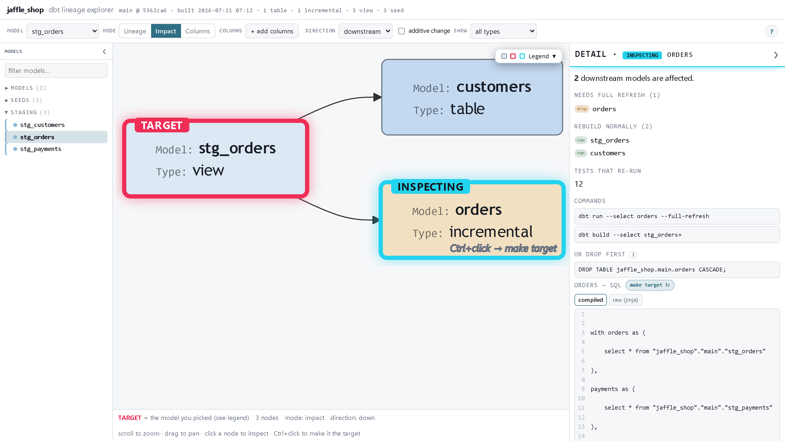

# dbt-walker

**Plan dbt full refreshes before you break something.** dbt incremental models
only append on a normal run — change a model's logic and every downstream
incremental still holds rows built with the *old* logic until someone
full-refreshes it. dbt-walker reads dbt's own artifacts (never your warehouse)
and answers, model-level and column-level: what feeds this, what reads it,
which downstream incrementals need a `--full-refresh`, and exactly which
commands (or `DROP ... CASCADE` DDL) to run.



*The visual explorer in Impact mode — `stg_orders` is the target; the
incremental `orders` model needs a full refresh, `customers` just rebuilds, and
the refresh plan (dbt commands + `DROP ... CASCADE` DDL) is ready to copy.*

## Highlights

- **Never touches your warehouse.** Everything works from `target/manifest.json`
  (and `target/compiled/` for column lineage) — artifacts `dbt compile` already
  produces.
- **Model-level commands are stdlib-only.** No dependencies at all; runs
  anywhere a manifest exists.
- **Column-level lineage** via [sqlglot](https://github.com/tobymao/sqlglot)
  over dbt's *compiled* SQL — change one column and see the (usually much
  smaller) set of models that actually read it.
- **Fails closed.** Lineage that can't be proven (`select *` over a join,
  dynamic macros, Python models) stays *in* the blast radius and is marked
  unproven — the tool never claims "safe" without proof.
- **A one-file visual explorer** (`build-app`): a self-contained HTML page with
  the model tree, pan/zoom lineage graph, refresh plans, and SQL with the
  producing lines highlighted. Fully offline (mermaid is bundled, no CDN) —
  fine behind a corporate proxy, fine to email to a teammate.

## Install

Not on PyPI (yet). From a clone:

```bash
pip install .[col]        # [col] adds sqlglot for the column-level commands
# or, model-level only, zero dependencies:
pip install .
```

Or as a standalone tool via [pipx](https://pipx.pypa.io/):

```bash
python -m build --wheel                       # writes dist/dbt_walker-*.whl
pipx install "dist/dbt_walker-0.3.1-py3-none-any.whl[col]"
```

Requires Python 3.10+.

## CLI

Run from inside a dbt project (anywhere with `target/manifest.json` — run
`dbt compile` first), or point `--project-dir` at one:

```bash
dbt-walker upstream customers                    # what it reads from
dbt-walker downstream stg_orders --mat incremental   # what reads it, filtered
dbt-walker impact stg_orders                     # the refresh plan (see below)
dbt-walker impact stg_orders --additive          # adding a column: incrementals with
                                                 #   on_schema_change append/sync survive
```

`impact` splits the blast radius into *needs full refresh* vs *rebuilds
normally*, lists upstream incremental prerequisites and the tests that re-run,
and always prints **both** refresh paths: the safe dbt commands
(`dbt run --select <models> --full-refresh`) and the explicit
`DROP TABLE ... CASCADE;` DDL — with the downstream views each CASCADE would
take out.

### Column-level

Changing one column usually affects far fewer models than changing the whole
model. These need the `[col]` extra; the SQL dialect is auto-detected from your
adapter (override with `--dialect`):

```bash
dbt-walker col-upstream   orders     --column amount     # where a column comes from
dbt-walker col-downstream stg_orders --column order_id   # what derives from it
dbt-walker impact stg_orders --column status             # impact, pruned to readers of `status`
```

If `target/catalog.json` exists (from `dbt docs generate`), the column
commands use its per-relation column inventories to resolve cases that are
otherwise unprovable — unqualified columns across joins and `select *` over
physical tables. It's per-relation and best-effort: a partial or missing
catalog just means those relations resolve as before, and a stale catalog is a
warning, never a hard stop. Reading it never touches the warehouse.

### Graphs and diffs

```bash
dbt-walker graph stg_orders                       # browser-viewable HTML (default)
dbt-walker graph stg_orders --column status       # only what a `status` change touches
dbt-walker graph stg_orders --format mermaid      # .mmd for GitHub / mermaid.live
dbt-walker graph --format dot --out - | dot -Tpng -o dag.png
dbt-walker diff --state prod/target/manifest.json # what changed vs prod, and where impact helps
```

Add `--json` to any command for machine-readable output.

## The visual explorer

```bash
cd your-dbt-project
dbt compile                 # the app is built from dbt's artifacts
dbt-walker build-app .      # -> ./<project>-lineage-<branch>-<timestamp>.html
```

One self-contained HTML file, open it in any browser. The expensive analysis
(sqlglot parsing, column edge extraction) runs once at build time in Python;
all traversal — lineage walks, impact classification, column taint,
SQL highlighting — runs on demand in the browser. No server, no network.

Inside:

- A searchable **model tree** and a pan/zoom **lineage graph**. Click a node to
  inspect it (SQL + details); Ctrl/Cmd-click to make it the **target**.
- **Three modes:** Lineage, Impact (the refresh plan from the screenshot), and
  Columns (pick columns, see both directions: what feeds them upstream and what
  derives from them downstream). Selecting several columns shows everything
  affected by *any* of them.
- **SQL highlighting** distinguishes *proven* derivations (solid) from
  *unproven* fail-closed ones (hatched), with exact line spans where sqlglot
  can prove them — including inside CTEs.
- If a model's columns can't be resolved, the app says *why* (and when
  `dbt docs generate` would fix it).

`build-app` never runs dbt for you — if `target/` is missing it tells you to
compile, and if model files are newer than the manifest it stamps a staleness
banner into the page.

## Documentation

- [`docs/REQUIREMENTS.md`](docs/REQUIREMENTS.md) — requirements, assumptions,
  non-goals, and per-phase acceptance criteria.

## Development

```bash
python -m venv .venv && .venv/Scripts/pip install -e .[dev]   # (bin/ on mac/linux)
cd tests/fixtures/jaffle_shop_duckdb && ../../../.venv/Scripts/dbt build --profiles-dir . && cd ../../..
.venv/Scripts/python -m pytest tests/ -q
```

Tests come in four layers: unit tests on inline manifests; column lineage
asserted against a deterministic synthetic-project generator's
`ground_truth.json`; a **parity** suite that runs the app's actual JavaScript
under node and asserts it agrees with the Python traversal; and a **browser**
suite where Playwright drives the real generated app in headless Chromium and
fails on any console error (`python -m playwright install chromium` to enable).
Larger fixtures — the synthetic projects and the real-world
[CountMoney](https://github.com/flyanakin/CountMoney) project — are gitignored
and built on demand by the scripts in `scripts/`; fixture-dependent tests skip
when they're absent.
